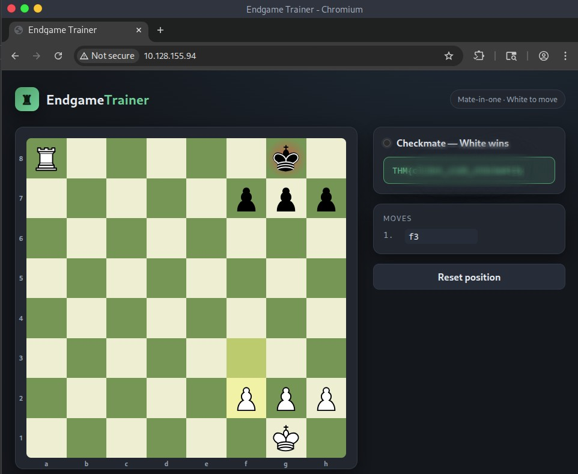

# Fools Mate

---

## Initial Enumeration

As always, we start with some basic enumeration.

```bash
nmap -sV -sC 10.130.138.73
```


Heading over to the website, we find an interactive chess application.


After looking through the page source, nothing particularly interesting stands out.

However, when playing the checkmate move (**Ra8 → Ra1**), a pop-up appears.


As always, it's worth running some directory enumeration, even if the application looks simple.

```bash
gobuster dir -u http://YOUR_IP -w /usr/share/wordlists/seclists/Discovery/Web-Content/common.txt
```


In this case, nothing useful is discovered, so we go back to inspecting the application itself.

---

## Challenge Analysis

While inspecting the page (**Right-click → Inspect**), two JavaScript files immediately stand out:

- **app.js**
    
- **chess.js**
    


The **chess.js** file turns out to be the standard open-source library used for handling chess logic.

The interesting one is **app.js**, which contains the code responsible for displaying the pop-up whenever a checkmate move is played.

To understand how the application behaves, we intercept the traffic with **Burp Suite**.

One strange thing immediately becomes obvious.

When attempting the checkmate move with the rook, **no HTTP request is ever sent**.


That tells us the move is being blocked entirely by the browser.

To confirm this, we move a different piece.

This time, the request reaches the server normally.


So the restriction is purely **client-side**.

---

## Flag

Now the solution becomes straightforward.

Instead of sending the checkmate move directly from the browser, we first make a legal move that reaches the server, intercept it in Burp Suite, and then simply modify the request.

Changing the **from** and **to** coordinates to match the rook's checkmate move gives us:


Forwarding the modified request causes the server to accept it and immediately return the flag.



---

## Conclusion

A short but enjoyable challenge.
It was a nice reminder that **client-side validation should never be trusted**, since anything happening inside the browser can be bypassed. A good little exercise for practicing Burp Suite and understanding the difference between client-side and server-side validation.

**— 0xchnk**